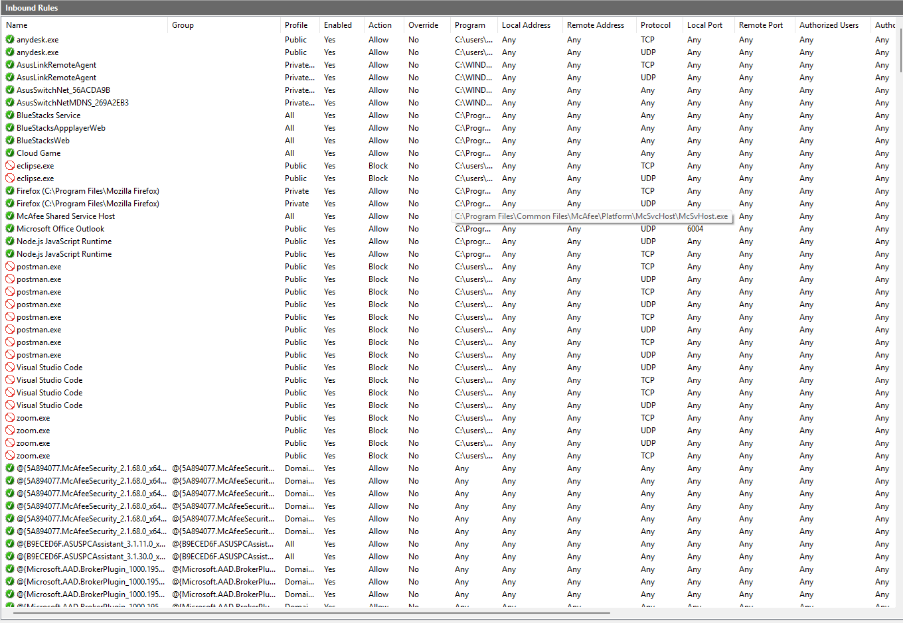
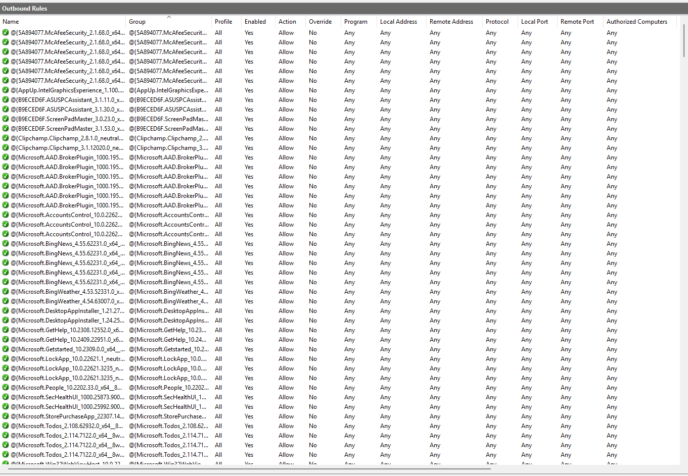
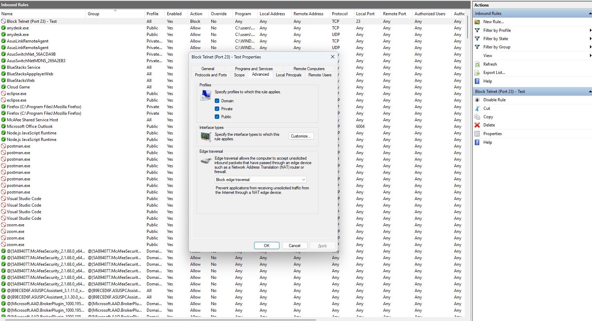
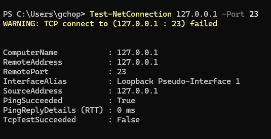
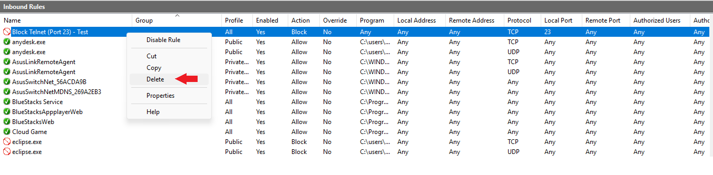

# 🔥 Setup and Use a Firewall (Windows)

## 🎯 Objective
Configure and test basic firewall rules to allow or block traffic  

**System**: Windows 11  
**Tool**: Windows Defender Firewall with Advanced Security

---

### ✅ Task Steps Completed 
#### 🔧 Firewall Configuration
- Opened the firewall management console:
- Run → `wf.msc`
- Reviewed Inbound and Outbound rule sets.

| Inbound Rules | Outbound Rules |
|----------|----------|
|  |  |

### 🚫 Created & Tested Block Rule
- Added an inbound rule blocking TCP port 23.
- Verified the rule using PowerShell:
`Test-NetConnection 127.0.0.1 -Port 23`
- Result: Connection failed (blocked)

| Block Port Rule | Testing |
|----------|----------|
|  |  |

### ♻️ Restored System State
- Deleted the custom block rule.
- Confirmed firewall returned to default behavior.

| Delete Rule/Restore System State |
|----------|
|  |

---

### Summary: How a Firewall Filters Traffic
- A firewall examines every incoming and outgoing packet and matches it against a list of ordered rules. Each rule checks protocol (TCP/UDP), source/destination IP, and port numbers.  
- If a packet matches a rule → the specified action (allow or block) is applied.  
- If no rule matches → the default policy is applied (on Windows: block all unsolicited inbound traffic).  
- Rules are processed top-to-bottom. the first match wins.
