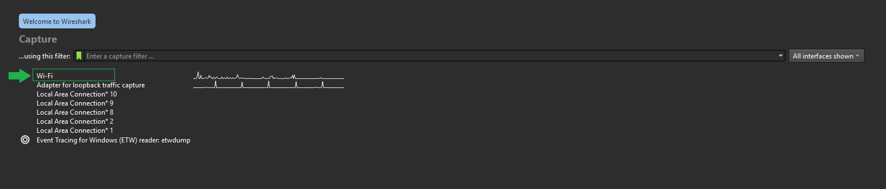
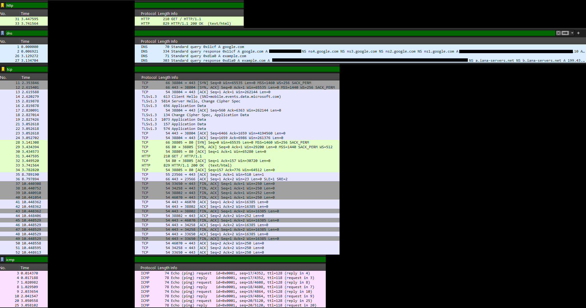

# 📡 Network Traffic Analysis Using Wireshark

## 🎯 Objective
Capture live network packets and identify basic protocols and traffic types.

**Tool:** Wireshark 

---

## 📃 Steps Performed to Capture and Save the Packets

1. **Installed Wireshark**  
   Downloaded and installed the latest stable version of Wireshark from [wireshark.org](https://www.wireshark.org) along with Npcap (for packet capturing on Windows).

2. **Selected Active Network Interface**  
   Opened Wireshark → Identified the active interface (Wi-Fi) by looking at the interface with a moving sparkline graph → Double-clicked it to start capturing.

3. **Generated Traffic**  
   Performed the following actions while capturing:
   - Opened browser and visited http://example.com (to generate clear HTTP traffic)
   - Visited https://google.com (to generate TLS/HTTPS traffic)

4. **Captured for ~90 seconds**  
Let Wireshark run until several thousand packets were captured, then clicked the red square button to stop the capture.

5. **Applied Filters to Verify Protocols**
Used the following display filters:
- `http` → Confirmed HTTP requests/responses
- `dns` → Confirmed DNS queries and answers
- `tls` → Confirmed encrypted HTTPS handshakes
- `icmp` → Confirmed ping echo requests/replies

6. **Saved the Capture File**
File → Export Specified Packets →  
Selected “All packets” → “Captured” →  
Saved as `network_capture_wireshark.pcapng` (Wireshark’s default modern format)

---

## 📑 Protocols Identified
| Protocol  | Description                              | Observed In                     |
|----------|------------------------------------------|---------------------------------|
| HTTP     | Unencrypted web browsing traffic         | Visiting http://example.com     |
| DNS      | Domain name resolution                   | Resolving google.com            |
| TCP/TLS  | Encrypted web traffic (HTTPS)            | Visiting https://google.com     |
| ICMP     | Ping requests and echo replies           | `ping google.com` |

---

## 📁 Files in This Repository
- `network_capture_wireshark.pcapng` → Full packet capture (anonymized)
- `screenshots/` → Visual proof of filters and packets

---

## 📸 Screenshots
### 📌 Interface Selection

### ⏳ Filtered Packets

**Note:** Most modern traffic is encrypted (TLS), So HTTP was generated by visiting http://example.com intentionally. Also submitted `.pcapng` file is anonymized.

