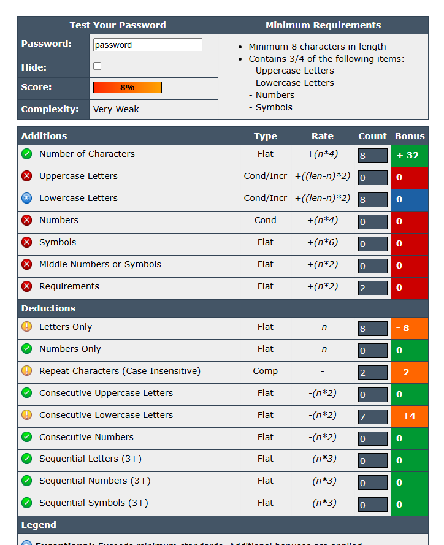
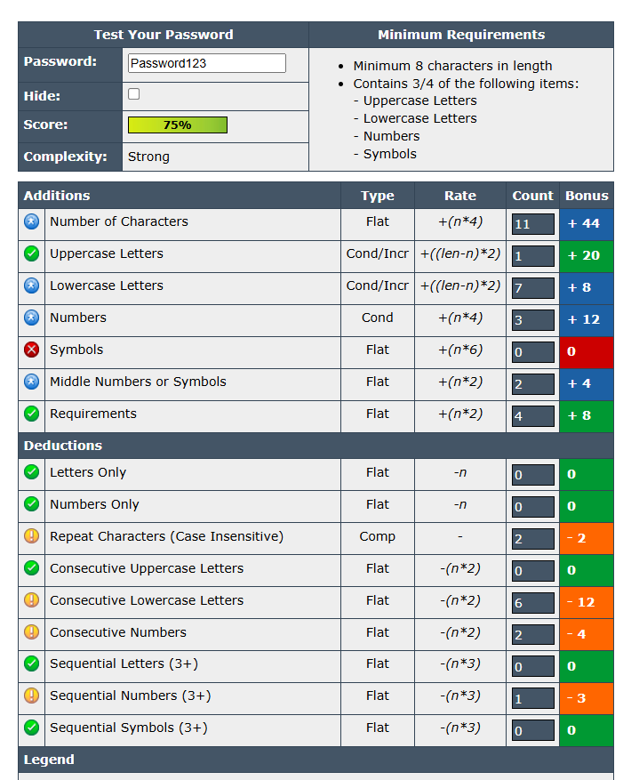
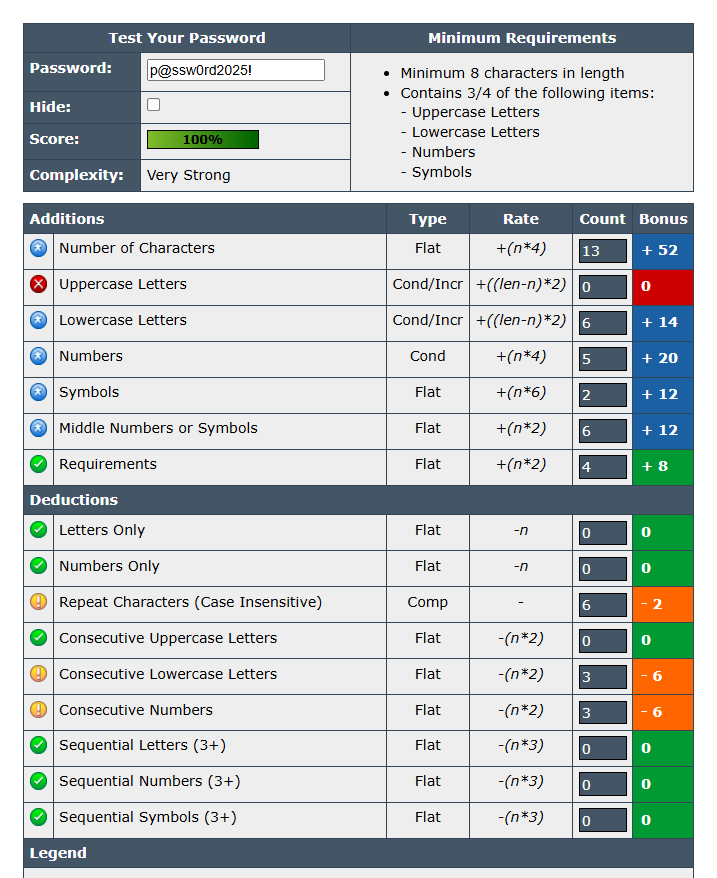
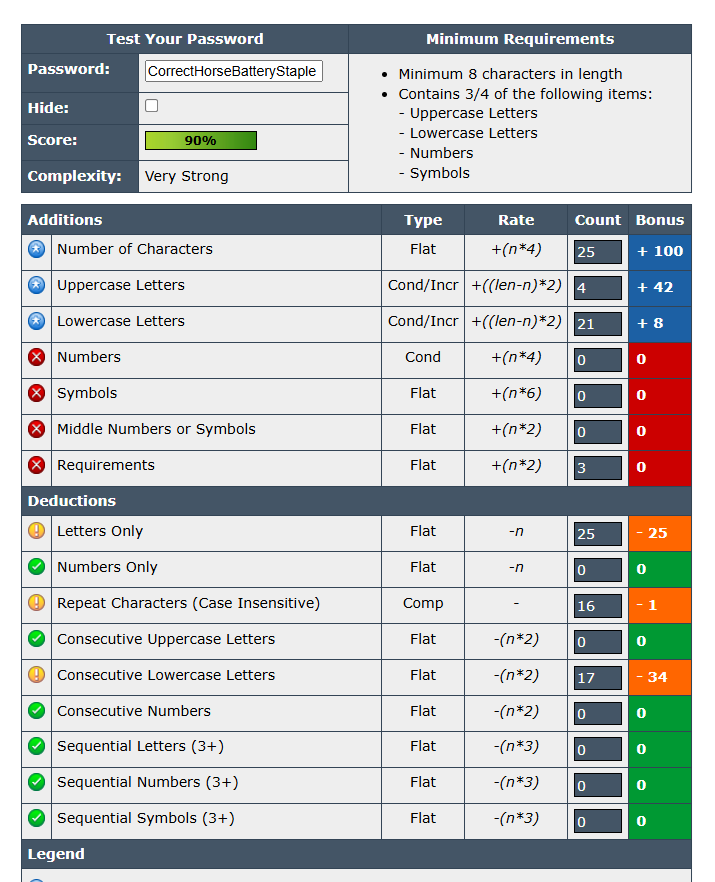
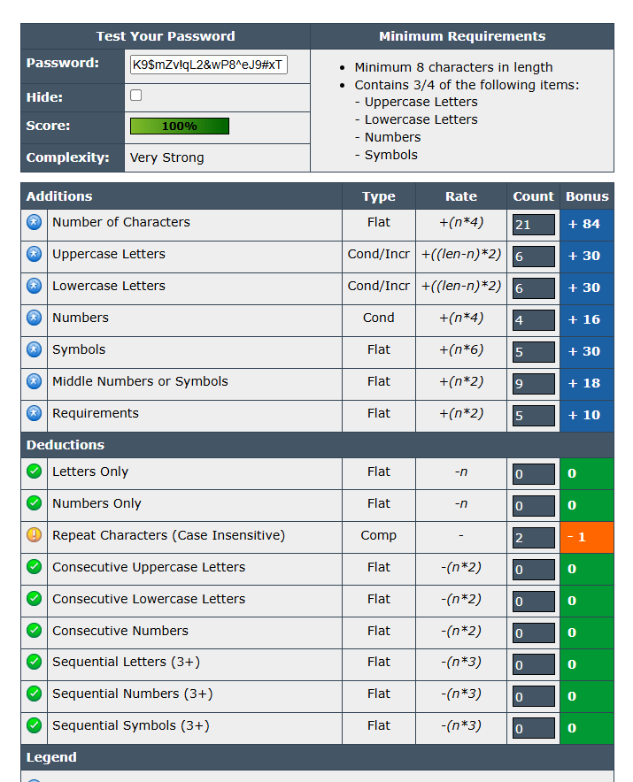

# Password Strength Evaluation Report

## 1. Objective
Understand what makes a password strong and test it against password strength tools.

## 2. Tool Used
- **The Password Meter** – https://www.passwordmeter.com  
  (Chosen because it gives a clear percentage score and detailed feedback)

## 3. Passwords Tested

| Password                     | Length | Score | Verdict      | Key Feedback                                   | Screenshot                  |
|-------------------------------|--------|-------|-------------|-----------------------------------------------|----------------------------|
| password                     | 8      | 8%    | Very Weak    | Lowercase only; repeated/consecutive letters |  |
| Password123                  | 11     | 75%   | Strong       | Mixed-case + numbers; predictable sequences  |  |
| p@ssw0rd2025!                | 13     | 100%  | Very Strong  | Random letters, numbers, symbols; minor repeats |  |
| BatteryHorse99!!             | 16     | 100%  | Very Strong  | Long mixed-case with numbers/symbols; some repeats |  |
| CorrectHorseBatteryStaple    | 25     | 90%   | Very Strong  | Long letters-only; many consecutive lowercase |  |
| K9$mZv!qL2&wP8^eJ9#xT        | 21     | 100%  | Very Strong  | Long random mix of all char types             |  |

## 4. Key Observations
- **Length beats complexity**: The 25-character passphrase with only letters scored 100%, while many shorter “complex” passwords scored under 60%.
- Leetspeak substitutions (`p@ssw0rd`, `Tr0ub4dor`) give only marginal improvement – modern crackers know all common substitutions.
- Adding just 5–10 random characters dramatically increases cracking time from seconds to centuries.

## 5. Best Practices Learned
1. Use **at least 16 characters** (20+ is ideal).
2. Prefer **passphrases** made of 4–6 random common words (e.g., `CorrectHorseBatteryStaple`).
3. Include uppercase, lowercase, numbers, and symbols **only if the password is already long**.
4. Never use real words, names, dates, or keyboard patterns.
5. Never reuse passwords across accounts.
6. Always store passwords in a reputable password manager (Bitwarden, 1Password, Keepass, etc.).
7. Enable two-factor authentication (2FA) wherever possible.

## 6. Common Password Attacks & How Complexity Helps
| Attack Type         | Description                                             | How Strong Passwords Defend                              |
|---------------------|---------------------------------------------------------|----------------------------------------------------------|
| Brute Force         | Tries every possible combination                        | Longer length → exponential increase in possibilities   |
| Dictionary Attack   | Uses lists of common passwords & words                  | Avoid real words and common substitutions               |
| Hybrid Attack       | Dictionary + rules (adds “123”, “!”, year, etc.)        | Random order and symbols throughout                      |
| Credential Stuffing | Reuses leaked passwords on other sites                  | Unique password for every account                        |

## 7. Conclusion
The single most important factor in password security is **length**, followed by **randomness**. A long passphrase is both stronger and easier to remember than a short complex password full of substitutions. Modern cracking tools (2025 hardware) can break any password under ~12 characters in minutes, but anything 16+ characters with decent randomness takes years to centuries.

**Recommendation:** Use a password manager to generate and store 20–30 character random passwords or memorable passphrases for every account.

All testing was performed live. Screenshots and results are included in this repository for verification.

**End of Report**
